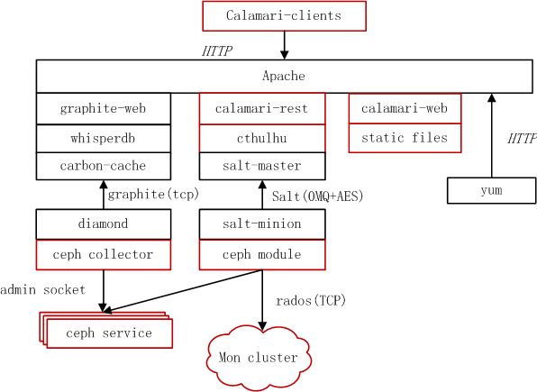

==================
使用Calamari监控ceph环境
==================

.. topic:: 关于Calamari

   Calamari项目开始于2013年夏天，创立它的初衷是开发一个Ceph管理平台, Calamari
   对外提供了十分漂亮的web管理和监控界面，以及一套改进的REST API接口
   （不同于Ceph自身的REST API），在一定程度上简化了Ceph的管理。

----
系统架构
----

下面Calamari的架构图能帮助更好的理解它的组件，其中红框部分为Calamari代码实现的部分，
非红框部分为非Calamari实现的开源框架。

#. 在Ceph server node安装的组件有Diamond和Salt-minion。
   Diamond负责收集监控数据，它除了收集Ceph本身的状态信息，它还可以收集关键的资源使用情况
   和性能数据，包括CPU，内存，网络，I/O负载和磁盘指标，然后报告给Graphite。

#. Graphite不仅是一个企业级的监控工具, 还可以实时绘图。

#. carbon-cache是Python实现的高度可扩展的事件驱动的I/O架构的后端进程，
   它可以有效地跟大量的客户端通信并且以较低的开销处理大量的业务量。

#. Whisper跟RRDtool类似，提供数据库开发库给应用程序来操纵和检索存储在特殊格式的
   文件数据（时间数据点数据），Whisper最基本的操作是创建作出新的Whisper文件，
   更新写入新的数据点到一个文件中，并获取检索的数据点；

#. Graphite_web是用户接口，用来生成图片，用户可以直接通过URL的方式访问这些生成的图片。

#. Calamari 使用了Saltstack让Calamari Server和Ceph server node通信。

   * Saltstack是一个开源的自动化运维管理工具，与Chef和Puppet功能类似。
   
   * Salt-master发送指令给指定的Salt-minion来完成对Cpeh Cluster的管理工作；
   
   * Salt-minion 在Ceph server node安装后都会从master同步并安装一个ceph.py文件，里面包含Ceph操作的API，它会调用librados或命令行来最终和Ceph Cluster通信。

#. calamari_rest提供Calamari REST API，详细的接口请大家参照官方文档。

#. cthulhu可以理解是Calamari Server的Service层，对上为API提供接口。

#. calamari_clients是一套用户界面。

----
安装部署
----

.. sourcecode:: console

   tar zxf calamari-el7.tar.gz
   sh install.sh 

