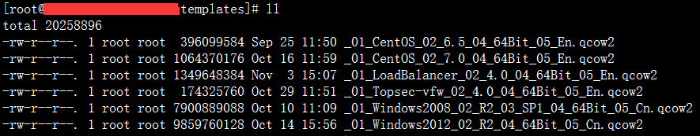

2Cloud云服务管理平台模板制作手册
===================

:Date: 2015-11-27
:Version: v4.0
:Authors: 董大伟  dawei@yunshan.net.cn 
:Changelog: init

概述
--

.. topic:: 文档说明

   2Cloud云服务平台依托数据中心硬件设施，为企业提供基于云平台的高品质、低成本、
   可扩展的基础设施服务（Infrastructure as a Service，IaaS），并根据硬件及运行环境的变化，
   动态地、高效地调度分配资源。

   2Cloud云服务平台是基于采用软件定义网络（Software-Defined Networking，SDN）技术，
   以网络虚拟化为基础整合数据中心的计算、存储资源，实现全局优化的大规模管理与调度。
   其特点是：可基于现有设备进行快速部署，规模可随业务增长而动态扩展；
   服务载体采用高资质数据中心硬件平台，服务管理采用自动纠错和冗余备份的智能软件平台。
 
 
.. topic:: 目的

   该手册讲解了如何制作v4.0 kvm平台各种系统的模板制作与使用。
   便于用户能够快速掌握模板的制作与使用。

读者对象
----

本手册适用于以下人员

* 2Cloud云平台客户
* 数据中心管理员
* 数据中心运维人员
* 云杉技术支持人员
 
模板命名规则
------

模板命名规则
++++++

模板命名规则请按照以下规则进行，需要在模板名称后面带上.qcow2

.. csv-table:: 模板名称定义规则
   :header: Key,Value,Comments
   :widths: 5, 5, 5
   
   1, 系统名称, "操作系统名称，如Centos、Ubuntu等"
   2, 版本号, "操作系统的发布版本号"
   3, 补丁包名称, "操作系统的升级补丁包（Service Package）"
   4, CPU位数, "操作系统位数【32bit或者64bit】"
   5, 系统语言, "操作系统语言"
   6, 模板序号, "模板更新修改的版本号记录"

如以下：
   

第三章模板制作
-------

CentOS6.5
+++++++++

#. 模板系统安装

   在kvm服务器上进行模板虚拟机的创建与安装，创建虚拟磁盘：

   .. sourcecode:: console
   
      qemu-img create -f qcow2 template.qcow2 50G
    
   创建模板虚拟机：
   
   .. sourcecode:: console
   
      virt-install --name template \
         --boot network,cdrom,menu=on \
         --ram 8192 \
         --vcpus=4  \
         --cdrom=/home/vmdisk/CentOS-6.5-x86_64-bin-DVD1.iso \
         --disk path=/home/vmdisk/template.qcow2,format=qcow2 \
         --network network=nspbr0,model=virtio \
         --network network=nspbr1,model=virtio \
         --vnc \
         --vncport=5901 \
         --vnclisten=0.0.0.0
    
   然后使用vnc连接控制台完成系统安装，安装模板系统:
   
   .. figure:: _static/tmpl/image002.png
      :width: 600px
      :alt: Sphinx Neo-Hittite
   
   安装完成后将模板虚拟机关机。
 
#. 配置xml文件：
   
   .. sourcecode:: console
   
      #virsh edit template
   
   在配置文件中添加以下内容：
   
   .. sourcecode:: console
   
      <channel type='unix'>
         <source mode='bind' path='/var/lib/libvirt/qemu/template.agent'/>
         <target type='virtio' name='org.qemu.guest_agent.0'/>
         <address type='virtio-serial' controller='0' bus='0' port='1'/>
      </channel>

   .. figure:: _static/tmpl/image003.png
      :width: 600px
      :alt: Sphinx Neo-Hittite
      
   修改完成后保存，并启动虚拟机：
   
   .. sourcecode:: console
   
      # virsh start template
 
#. 安装常用软件：

   .. sourcecode:: console
   
      yum install –y wget tcpdump vim ...
 
#. 修改ttyS0，确保virsh console可以登录系统：

   .. sourcecode:: console
   
      cat<<'EOF' > /etc/init/ttyS0.conf
      stop on runlevel [S016]
      start on runlevel [2345]
      respawn
      instance /dev/ttyS0
      exec /sbin/mingetty ttyS0
      EOF

#. 上传最新的vm_init.sh到/etc下改成可执行权限：

   .. figure:: _static/tmpl/image004.png
      :width: 600px
      :alt: Sphinx Neo-Hittite

#. 上传qemu-ga到/usr/bin下，改成可执行权限，并添加respawn脚本

   .. figure:: _static/tmpl/image005.png
      :width: 600px
      :alt: Sphinx Neo-Hittite

   .. sourcecode:: console
   
      cat<<'EOF' > /etc/init/qemu-ga.conf
      # qemu-ga
      start on runlevel [2345]
      stop on runlevel [016]
       
      respawn
      env TRANSPORT_METHOD="virtio-serial"
      env DEVPATH="/dev/virtio-ports/org.qemu.guest_agent.0"
      env LOGFILE="/var/log/qemu-ga/qemu-ga.log"
      env PIDFILE="/var/run/qemu-ga.pid"
      env BLACKLIST_RPC="guest-file-open guest-file-close guest-file-read guest-file-write guest-file-seek guest-file-flush"
       
      pre-start script
      [ -d /var/log/qemu-ga ] || mkdir -p /var/log/qemu-ga
      [ -d /usr/local/var/run/ ] || mkdir -p /usr/local/var/run/
      end script
      exec /usr/bin/qemu-ga --method $TRANSPORT_METHOD --path $DEVPATH --logfile $LOGFILE --pidfile $PIDFILE --blacklist $BLACKLIST_RPC
      EOF
 
#. 添加默认DNS：

   .. sourcecode:: console
   
      echo "nameserver 223.5.5.5" >/etc/resolv.conf
 
#. 关闭防火墙规则及关闭 **SElinux**：

   .. sourcecode:: console
   
      # service iptables stop
      # chkconfig iptables off
   
   修改 ``/etc/selinux/config`` 文件中的 ``SELINUX=""`` 为  *disabled*
 
#. 删除网卡配置文件

   .. sourcecode:: console
   
      rm -fr /etc/sysconfig/network-scripts/ifcfg-eth*
    
#. 删除70-persistent-net.rules配置文件
   
   .. sourcecode:: console
   
      rm -fr /etc/udev/rules.d/70-persistent-net.rules
    
#. 删除history记录后关机
   
   .. sourcecode:: console
   
      history–c
      history –w
      history –c
      shutdown –h now
    
至此，模板制作完成，将模板虚拟机的磁盘文件按照2.1章节命名规则改名后，导入ceph池中即可。
 
Ubuntu12.04.5
+++++++++++++

#. 模板系统安装

   在kvm服务器上进行模板虚拟机的创建与安装，创建虚拟磁盘：
   
   .. sourcecode:: console
   
      qemu-img create -f qcow2 template_v4.0_kvm_ubuntu12.04.5_en.qcow2 50G
    
   创建模板虚拟机：
   
   .. sourcecode:: console
   
      virt-install --name template_v4.0_kvm_ubuntu12.04.5_en \
         --boot network,cdrom,menu=on \
         --ram 8192 \
         --vcpus=4  \
         --cdrom=/home/vmdisk/ubuntu-12.04.5-server-amd64.iso \
         --disk path=/home/vmdisk/template_v4.0_kvm_ubuntu12.04.5_en.qcow2,format=qcow2 \
         --network network=nspbr0,model=virtio \
         --network network=nspbr1,model=virtio \
         --vnc \
         --vncport=5901 \
         --vnclisten=0.0.0.0
    
   然后使用vnc连接控制台完成系统安装，安装模板系统:
   
   .. figure:: _static/tmpl/image006.png
         :width: 600px
         :alt: Sphinx Neo-Hittite

#. 删除普通用户，启用root

   .. sourcecode:: console
   
      ubuntu@ubuntu:~$ sudosu切换到root
      root@ubuntu:/home/ubuntu# passwd设置root密码
      root@ubuntu:/home/ubuntu# exit退出普通用户使用root登陆
      root@ubuntu:~# userdel -r ubuntu删除普通用户,后续使用root用户操作
    
   然后将模板虚拟机关机。
 
#. 配置xml文件：

   .. sourcecode:: console
   
      #virsh edit template
     
   在配置文件中添加以下内容：
   
   .. sourcecode:: console
   
      <channel type='unix'>
         <source mode='bind' path='/var/lib/libvirt/qemu/ template_v4.0_kvm_ubuntu12.04.5_en.agent'/>
         <target type='virtio' name='org.qemu.guest_agent.0' state='connected'/>
         <alias name='channel0'/>
         <address type='virtio-serial' controller='0' bus='0' port='1'/>
      </channel>
   
   .. figure:: _static/tmpl/image007.png
         :width: 600px
         :alt: Sphinx Neo-Hittite
    
   修改完成后保存，并启动虚拟机：
   
   .. sourcecode:: console
   
      # virsh start template_v4.0_kvm_ubuntu12.04.5_en
   
#. 更改默认的dash为bash：

   .. sourcecode:: console
   
      dpkg-reconfigure dash
      
   选择NO

#. 安装常用软件：

   .. sourcecode:: console
   
      apt-get install wget tcpdump vim ...
 
#. 修改ttyS0，确保virsh console可以登录系统：

   .. sourcecode:: console
   
      cat<<'EOF' > /etc/init/ttyS0.conf
      # ttyS0 - getty
      #
      # This service maintains a getty on tty1 from the point the system is
      # started until it is shut down again.
       
      start on stopped rc RUNLEVEL=[2345] and (
      not-container or
      container CONTAINER=lxc or
      container CONTAINER=lxc-libvirt)
       
      stop on runlevel [!2345]
       
      respawn
      exec /sbin/getty -8 115200 ttyS0
      EOF
   
#. 上传最新的vm_init.sh到/etc下改成可执行权限：

   .. figure:: _static/tmpl/image008.png
         :width: 600px
         :alt: Sphinx Neo-Hittite
 
#. 上传qemu-ga到/usr/bin下，改成可执行权限，并添加respawn脚本

   .. figure:: _static/tmpl/image009.png
         :width: 600px
         :alt: Sphinx Neo-Hittite
   
   .. sourcecode:: console
   
      cat<<'EOF' > /etc/init/qemu-ga.conf
      # qemu-ga
      start on runlevel [2345]
      stop on runlevel [016]
       
      respawn
      env TRANSPORT_METHOD="virtio-serial"
      env DEVPATH="/dev/virtio-ports/org.qemu.guest_agent.0"
      env LOGFILE="/var/log/qemu-ga/qemu-ga.log"
      env PIDFILE="/var/run/qemu-ga.pid"
      env BLACKLIST_RPC="guest-file-open guest-file-close guest-file-read guest-file-write guest-file-seek guest-file-flush"
       
      pre-start script
      [ -d /var/log/qemu-ga ] || mkdir -p /var/log/qemu-ga
      [ -d /usr/local/var/run/ ] || mkdir -p /usr/local/var/run/
      end script
      exec /usr/bin/qemu-ga --method $TRANSPORT_METHOD --path $DEVPATH --logfile $LOGFILE --pidfile $PIDFILE --blacklist $BLACKLIST_RPC
      EOF
 
   手工创建以下目录：

   .. sourcecode:: console
   
      mkdir -p /usr/var/run
 
#. 暂时放开iptables规则：

   .. sourcecode:: console
   
      root@ubuntu:~# iptables -P INPUT ACCEPT
      root@ubuntu:~# iptables -P OUTPUT ACCEPT
 
#. 添加默认DNS：

   .. sourcecode:: console
   
      echo "nameserver 223.5.5.5" > /etc/resolvconf/resolv.conf.d/base
      resolvconf–u
 
#. 重启虚拟机确认qemu-ga正常运行：

   .. figure:: _static/tmpl/image010.png
         :width: 600px
         :alt: Sphinx Neo-Hittite
 
#. 删除虚拟机网卡接口IP信息

#. 删除history记录后关机

   .. sourcecode:: console
   
      history–c
      history –w
      history –c
      shutdown –h now
 
至此，模板制作完成，将模板虚拟机的磁盘文件按照2.1章节命名规则改名后，导入ceph池中即可。
 
Windows2008R2sp1
++++++++++++++++

#. 模板系统安装

   在kvm服务器上进行模板虚拟机的创建与安装，创建虚拟磁盘：
   
   .. sourcecode:: console
   
      qemu-img create -f qcow2 template_v4.1_kvm_windows2008r2sp1std_cn.qcow2 50G
    
   创建模板虚拟机：
   
   .. sourcecode:: console
   
      virt-install --name template_v4.1_kvm_windows2008r2sp1std_cn \
         --boot network,cdrom,menu=on \
         --ram 8192 \
         --vcpus=4  \
         --cdrom=/home/vmdisk/cn_windows_server_2008_r2_standard_enterprise_datacenter_and_web_with_sp1_vl_build_x64_dvd_617396.iso \
         --disk path=/home/vmdisk/template_v4.1_kvm_windows2008r2sp1std_cn.qcow2,format=qcow2 \
         --network network=nspbr0,model=virtio \
         --network network=nspbr1,model=virtio \
         --vnc \
         --vncport=5901 \
         --vnclisten=0.0.0.0
    
   然后使用vnc连接控制台完成系统安装，安装模板系统:
   
   .. figure:: _static/tmpl/image011.png
            :width: 600px
            :alt: Sphinx Neo-Hittite
         
#. 配置xml文件：

   .. sourcecode:: console
   
      #virsh edit template_v4.1_kvm_windows2008r2sp1std_cn
   
   在配置文件中添加以下2段内容：
   
   .. sourcecode:: console
   
      <channel type='unix'>
         <source mode='bind' path='/var/lib/libvirt/qemu/agent.agent'/>
         <target type='virtio' name='org.qemu.guest_agent.0' state='connected'/>
         <alias name='channel0'/>
         <address type='virtio-serial' controller='0' bus='0' port='1'/>
      </channel>
   
   .. sourcecode:: console
    
      <controller type='scsi' index='0' model='virtio-scsi'>
         <address type='pci' domain='0x0000' bus='0x00' slot='0x0a' function='0x0'/>
      </controller>

   .. figure:: _static/tmpl/image012.png
         :width: 600px
         :alt: Sphinx Neo-Hittite
         
   .. figure:: _static/tmpl/image013.png
         :width: 600px
         :alt: Sphinx Neo-Hittite
         
   修改完成后保存，并启动虚拟机：
   
   .. sourcecode:: console
   
      virsh start template_v4.1_kvm_windows2008r2sp1std_cn

#. 安装virtio驱动：

   将virtio驱动通过网络或iso的方式复制到模板虚拟机内，然后打开设备管理器进行依次安装：
   
   .. figure:: _static/tmpl/image014.png
            :width: 600px
            :alt: Sphinx Neo-Hittite
   
   .. figure:: _static/tmpl/image015.png
            :width: 600px
            :alt: Sphinx Neo-Hittite         

   .. figure:: _static/tmpl/image016.png
            :width: 600px
            :alt: Sphinx Neo-Hittite    
            
   .. figure:: _static/tmpl/image017.png
            :width: 600px
            :alt: Sphinx Neo-Hittite    
            
   .. figure:: _static/tmpl/image018.png
            :width: 600px
            :alt: Sphinx Neo-Hittite  
            
   .. figure:: _static/tmpl/image019.png
            :width: 600px
            :alt: Sphinx Neo-Hittite  
                                          
   按照以上方法把所有virtio驱动安装完成。
 
#. 安装.net 4.0、winrar、python、qemu-ga.msi等：

   .. figure:: _static/tmpl/image020.png
            :width: 600px
            :alt: Sphinx Neo-Hittite   
            
   Python装好后设置一下系统环境变量：

   .. figure:: _static/tmpl/image021.png
            :width: 600px
            :alt: Sphinx Neo-Hittite  
 
#. 获取7za.exe，curl.exe和vm_init.bat，并将这些放置到C:\Windows\System32\下

#. 获取vagent.tar.gz，并解压到C:\Windows下，然后执行：

   .. sourcecode:: console
   
      python C:\Windows\vagent\vagent_service.py install
      python C:\Windows\vagent\vagent_service.py start
      sc config "vagent" start= auto

#. Windows 密码设置：

   运行【gpedit.msc】→【计算机配置】→【WINDOWS设置】→【安全设置】→【帐户策略】→【密码策略】，
   设置【密码必须符合复杂性要求】为【已禁用】，设置【密码长度最小值】为【0】。

   .. figure:: _static/tmpl/image022.png
            :width: 600px
            :alt: Sphinx Neo-Hittite  
            
#. 清空Administrator密码：

   系统桌面【计算机】右键【管理】进入服务器管理器界面，【配置】→【本地用户和组】→【用户】，
   右侧【Administrator】右键【设置密码】→【继续】，设置密码为空，【确定】；

   .. figure:: _static/tmpl/image023.png
            :width: 600px
            :alt: Sphinx Neo-Hittite  

#. 关闭Windows防火墙：

   .. figure:: _static/tmpl/image024.png
            :width: 600px
            :alt: Sphinx Neo-Hittite  
             
第四章模板导入
-------

导入方式
++++

目前有2种方式导入：

#. 通过一键部署脚本导入

   将模板文件上传到deploy服务器的/opt/templates/下，将按命名规则命名，然后执行：
   
   .. sourcecode:: console
   
      ./lc_deploy.sh install template
    
   进行导入

#. 通过import_to_ceph.sh脚本导入：

   将模板文件和import_to_ceph.sh脚本上传到任意1台kvm服务器上，执行以下脚本导入：
   
   .. sourcecode:: console
   
      ./import_to_ceph.sh _01_Ubuntu_02_12.04.5_04_64Bit_05_En.qcow2 \
         _01_Ubuntu_02_12.04.5_04_64Bit_05_En capacity

   .. warning:: 注意事项
   
      通过import_to_ceph.sh脚本方式导入后，需要在所有的kvm服务器上刷新pool
   
      .. sourcecode:: console
      
         virsh pool-refresh capacity
